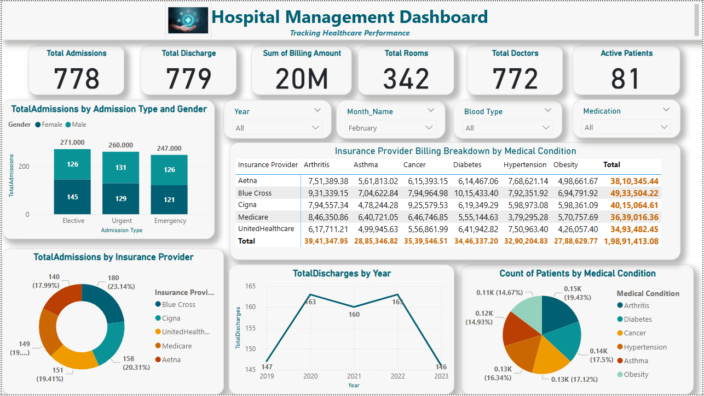

# Hospital Management Dashboard

## Overview
The **Hospital Management Dashboard** provides key insights into hospital operations, including **admissions, discharges, billing, patient demographics, and insurance provider analysis**. This dashboard helps in tracking hospital performance and improving healthcare decision-making.

## Data Source
- **Kaggle** (Hospital Management Dataset)
- **Data Cleaning & Modeling**: Performed in Power BI

## Key Insights:
- **Total Admissions & Discharges**: The hospital has **778 admissions** and **779 discharges**, indicating a well-balanced patient flow.
- **Billing Analysis**: **UnitedHealthcare** has the highest total billing (**₹49.3M**), followed by **Cigna** and **Blue Cross**.
- **Gender & Admission Type**: **Elective admissions** are the highest, followed by **urgent** and **emergency cases**.
- **Insurance Provider Distribution**: The **pie chart** shows that **UnitedHealthcare and Medicare** contribute the most admissions.
- **Total Discharges Trend**: Discharges peaked in **2021 (160)** but dropped to **146 in 2023**.
- **Medical Condition Breakdown**: **Arthritis** has the highest patient count, followed by **Diabetes** and **Cancer**.

## Files in this Folder:
- `Hospital_Management.pbix` - Power BI Project File
- `Hospital_Management.png` - Screenshot of the Dashboard

## Preview:

